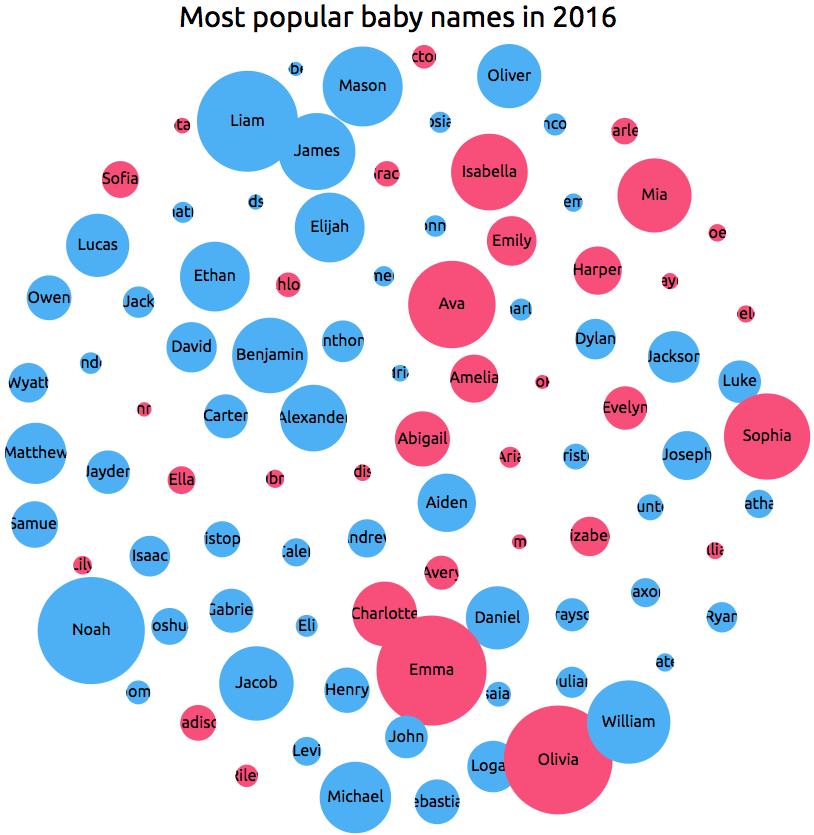

## Members

<dl>
<dt><a href="#babyNameData">babyNameData</a></dt>
<dd>
Using data from the US Social Security Administration, this file will generate an SVG
bubble chart that displays the frequency of the occurrence of that name in a given year.
The data goes from 1880-Present (2016) as of Summer 2017.

Check out the live example [here](https://taylorchasewhite.github.io/babyNames/).
</dd>
</dl>

## Functions

<dl>
<dt><a href="#babyNamesInitialize">babyNamesInitialize(generationData)</a></dt>
<dd>
Generates the DOM elements into specified DIVs from specified datasets.

</dd>
<dt><a href="#genMultipleBabyNameLists">genMultipleBabyNameLists(generationData)</a></dt>
<dd>
Generate baby name lists for multiple

</dd>
<dt><a href="#genBabyNameList">genBabyNameList(elementIDs, path)</a></dt>
<dd>
Generates a list and bubble chart of baby names into the DOM

</dd>
<dt><a href="#babyNameSearchInitialize">babyNameSearchInitialize(generationData)</a></dt>
<dd>
Initialize HTML elements needed to trigger searches

</dd>
<dt><a href="#getReturnString">getReturnString(maleNameResults, femaleNameResults, sizeOfSet)</a> ⇒</dt>
<dd>
Return back a friendly string that details how popular a given name was for both boys and girls

</dd>
<dt><a href="#getSexAheadString">getSexAheadString(birthCount)</a> ⇒</dt>
<dd>
Add the ordinal suffix to numbers greater than zero, otherwise return empty string

</dd>
<dt><a href="#generateBabyBubbleChart">generateBabyBubbleChart(babyData, parentDivID)</a></dt>
<dd>
Generates the D3 SVG to display and renders the bubble chart

</dd>
<dt><a href="#bindBabyNamesToDOM">bindBabyNamesToDOM(babyData, parentDivID)</a></dt>
<dd>
Generates the D3 ordered list from the data.

</dd>
<dt><a href="#removeBabyNamesFromDOM">removeBabyNamesFromDOM(parentDivID)</a></dt>
<dd>
Remove the list of names from the DOM

</dd>
<dt><a href="#removeBabyChart">removeBabyChart(parentDivID)</a></dt>
<dd>
Remove the bubble chart containing the data regarding names for a year

</dd>
</dl>

## babyNameData
Using data from the US Social Security Administration, this file will generate an SVG
bubble chart that displays the frequency of the occurrence of that name in a given year.
The data goes from 1880-Present (2016) as of Summer 2017.

**Kind**: global variable  
**Summary**: Generate a bubble chart showing frequency of US names by year.  
**Requires**: <code>module:d3.v4.js</code>, <code>module:jquery</code>  
**Since**: 07.04.17  
**Author**: Taylor White <whitetc2@gmail.com>  

## babyNamesInitialize(generationData)
Generates the DOM elements into specified DIVs from specified datasets.

**Kind**: global function  
**Access**: public  

| Param | Type | Description |
| --- | --- | --- |
| generationData | <code>Object</code> | Array of JSON data structured like so: |
| generationData.id | <code>Array.&lt;string&gt;</code> | An array of div IDs indicating where to render content 							[0] - The div ID to contain the ordered list 										[1] - The div ID to containt the bubble chart |
| generationData.path | <code>string</code> | Path to the file with data to load |
| generationData.selRelated | <code>string</code> | Indicates if this dataset should be relaoded when changing years |

## genMultipleBabyNameLists(generationData)
Generate baby name lists for multiple

**Kind**: global function  
**Access**: public  

| Param | Type | Description |
| --- | --- | --- |
| generationData | <code>Object</code> | Array of JSON data structured like so: |
| generationData.id | <code>Array.&lt;string&gt;</code> | An array of div IDs indicating where to render content 							[0] - The div ID to contain the ordered list 										[1] - The div ID to containt the bubble chart |
| generationData.path | <code>string</code> | Path to the file with data to load |
| generationData.selRelated | <code>string</code> | Indicates if this dataset should be relaoded when changing years |

## genBabyNameList(elementIDs, path)
Generates a list and bubble chart of baby names into the DOM

**Kind**: global function  
**Access**: public  

| Param | Type | Description |
| --- | --- | --- |
| elementIDs | <code>Array.&lt;string&gt;</code> | An array of html element IDs (length of 2) 								[0] - The div ID to contain the ordered list 								[1] - The div ID to containt the bubble chart |
| path | <code>string</code> | The path to the SSA csv data for a given year |

## babyNameSearchInitialize(generationData)
Initialize HTML elements needed to trigger searches

**Kind**: global function  
**Access**: public  

| Param | Type | Description |
| --- | --- | --- |
| generationData | <code>Object</code> | Array of JSON data structured like so: |
| generationData.id | <code>Array.&lt;string&gt;</code> | An array of div IDs indicating where to render content 							[0] - The div ID to contain the ordered list 										[1] - The div ID to containt the bubble chart |
| generationData.path | <code>string</code> | Path to the file with data to load |
| generationData.searchTerm | <code>string</code> | The term we are to search for |

## getReturnString(maleNameResults, femaleNameResults, sizeOfSet) ⇒
Return back a friendly string that details how popular a given name was for both boys and girls

**Kind**: global function  
**Returns**: string - A nicely formatted string detailing the popularity of a name  

| Param | Type | Description |
| --- | --- | --- |
| maleNameResults | <code>Array.&lt;Object&gt;</code> | Contains the search result data for males born in a given year |
| femaleNameResults | <code>Array.&lt;Object&gt;</code> | Contains the search result data for females born in a given year |
| sizeOfSet | <code>number</code> | The total size of the number of names born in a given year |

## getSexAheadString(birthCount) ⇒
Add the ordinal suffix to numbers greater than zero, otherwise return empty string

**Kind**: global function  
**Returns**: - The ordinal suffix of a number  

| Param | Type | Description |
| --- | --- | --- |
| birthCount | <code>any</code> | number of babies born |

## generateBabyBubbleChart(babyData, parentDivID)
Generates the D3 SVG to display and renders the bubble chart

**Kind**: global function  
**Access**: public  

| Param | Type | Description |
| --- | --- | --- |
| babyData | <code>Array.&lt;Object&gt;</code> | An array of JSONs representing the baby data |
| babyData[].Name | <code>Object</code> | Name of the child being born |
| babyData[].Sex | <code>Object</code> | The sex of the baby born (can be M/F). |
| babyData[].BirthCount | <code>Object</code> | The number of babies born thtat year |
| parentDivID | <code>string</code> | The div to containt the chart |

## bindBabyNamesToDOM(babyData, parentDivID)
Generates the D3 ordered list from the data.

**Kind**: global function  
**Access**: public  

| Param | Type | Description |
| --- | --- | --- |
| babyData | <code>Array.&lt;Object&gt;</code> | The array of JSON data containing names, their sex and frequency |
| babyData[].Name | <code>Object</code> | Name of the child being born |
| babyData[].Sex | <code>Object</code> | The sex of the baby born (can be M/F). |
| babyData[].BirthCount | <code>Object</code> | The number of babies born thtat year |
| parentDivID | <code>string</code> | The div to render the ordered list into. |

## removeBabyNamesFromDOM(parentDivID)
Remove the list of names from the DOM

**Kind**: global function  
**Access**: public  

| Param | Type |
| --- | --- |
| parentDivID | <code>string</code> | 

## removeBabyChart(parentDivID)
Remove the bubble chart containing the data regarding names for a year

**Kind**: global function  
**Access**: public  

| Param | Type | Description |
| --- | --- | --- |
| parentDivID | <code>string</code> | HTML element ID to remove data from |
